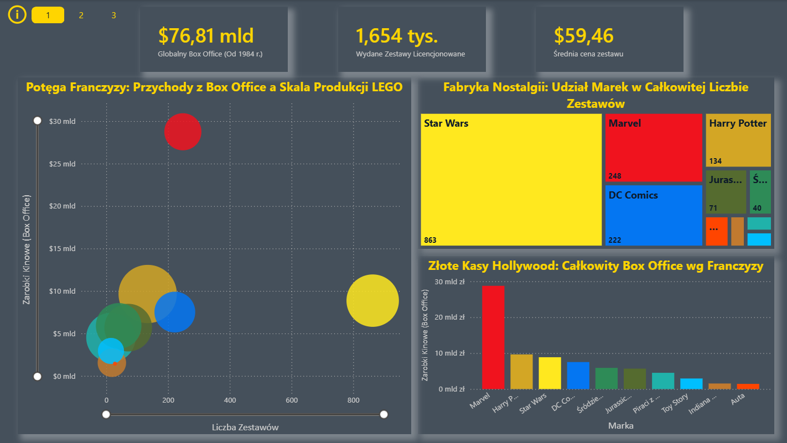
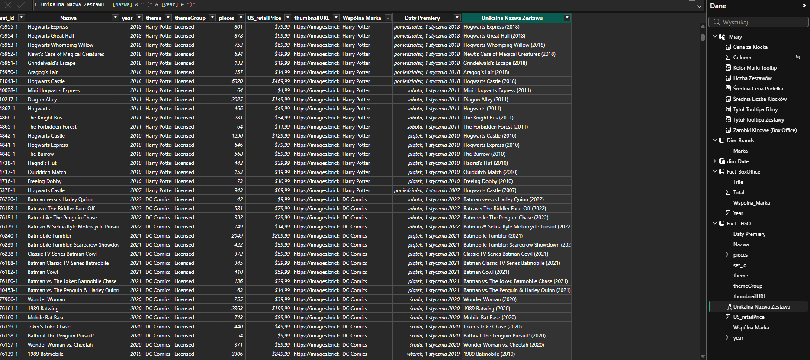
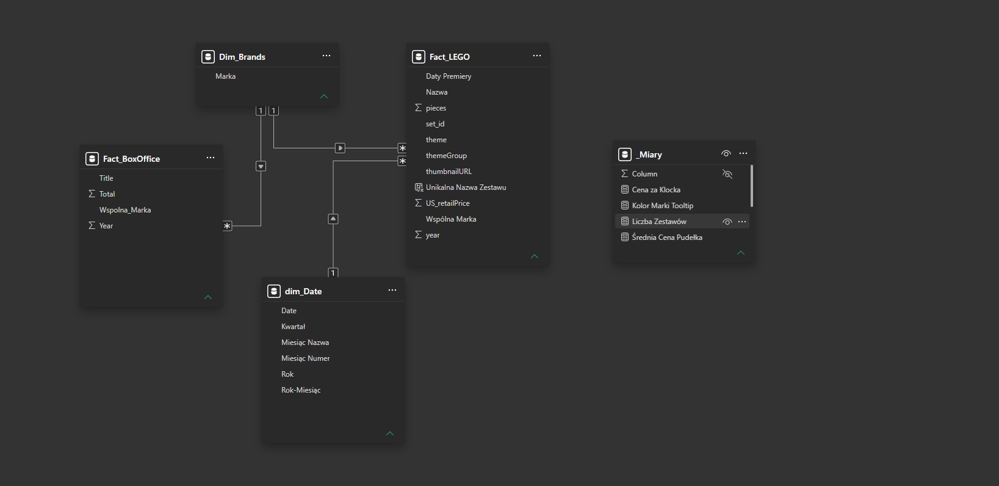
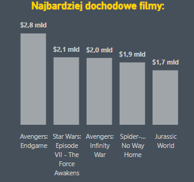
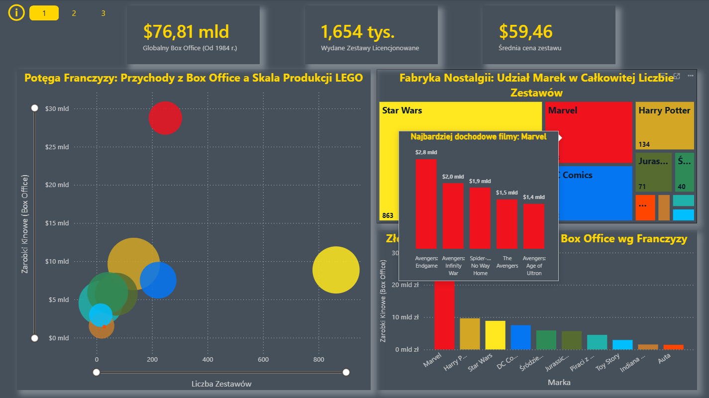
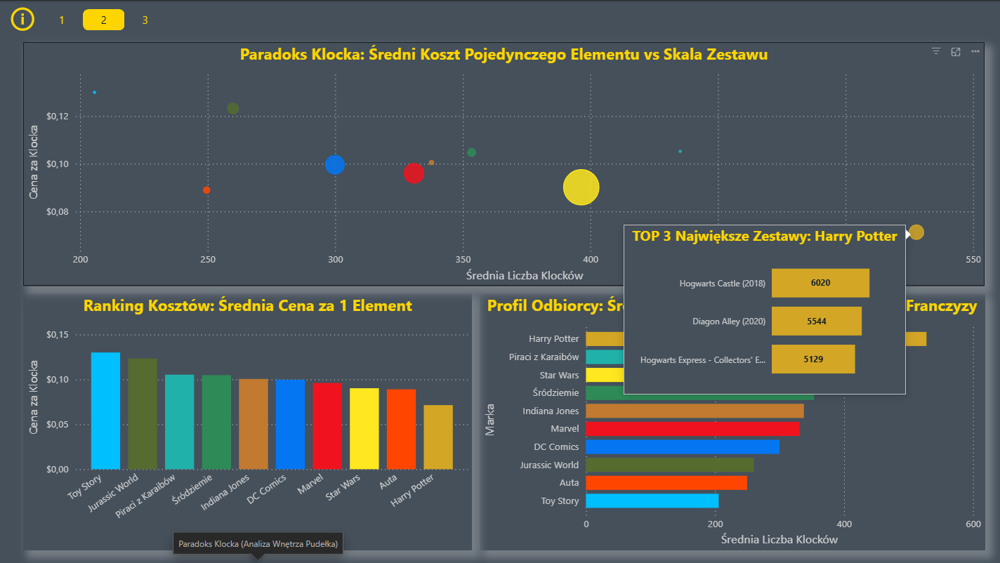
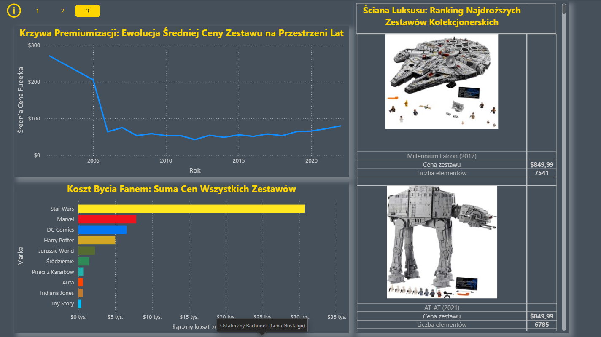

# power-bi-lego-franchise-value-analysis

Power BI analysis of LEGO licensed sets, price per set, price per piece and the relationship between movie franchises, Box Office performance and LEGO pricing.

## LEGO, filmy i cena klocka – czy filmowe uniwersum wpływa na ceny LEGO?

Projekt analityczny wykonany w Power BI, którego celem jest zbadanie zależności pomiędzy filmowymi franczyzami a ofertą licencjonowanych zestawów LEGO.

Analiza obejmuje nie tylko ceny całych zestawów, ale również **cenę pojedynczego klocka (Price per Piece)**, liczbę elementów oraz różnice pomiędzy poszczególnymi franczyzami.

Dane dotyczące zestawów LEGO zostały połączone z danymi dotyczącymi wyników Box Office wybranych filmowych uniwersów. Pozwala to sprawdzić, **czy obecność i popularność filmowej franczyzy znajduje odzwierciedlenie w cenach oraz charakterystyce oferty LEGO**.

---

## Cel projektu

Główne pytanie analityczne:

> **Czy i w jakim stopniu obecność licencjonowanego uniwersum filmowego wpływa na ceny zestawów LEGO oraz cenę pojedynczego klocka?**

Dodatkowe pytania:

- Czy zestawy należące do różnych franczyz mają różną średnią cenę?
- Czy franczyza filmowa wpływa na `Price per Piece`?
- Czy większa liczba klocków oznacza proporcjonalnie wyższą cenę zestawu?
- Czy małe zestawy mogą charakteryzować się wysoką ceną pojedynczego klocka?
- Czy popularność franczyzy mierzona wynikami Box Office znajduje odzwierciedlenie w cenach LEGO?
- Czy poszczególne franczyzy mają różne strategie produktowe i cenowe?
- Czy zmiany w ofercie LEGO można powiązać z rozwojem popularności określonych filmowych uniwersów?

---

## Zakres analizy

Analiza obejmuje licencjonowane zestawy LEGO powiązane z 10 wybranymi franczyzami filmowymi:

- Star Wars
- Marvel
- Harry Potter
- Jurassic World
- DC Comics
- Toy Story
- Auta
- Śródziemie
- Piraci z Karaibów
- Indiana Jones

Analizowany okres obejmuje lata **1984–2024**.

Z analizy wyłączono oryginalne serie LEGO, takie jak:

- LEGO City
- LEGO Ninjago
- LEGO Creator

Dzięki temu analiza koncentruje się na zestawach związanych z licencjonowanymi franczyzami filmowymi.

---

## Dashboard



Dashboard został zaprojektowany w stylistyce **Cinema Dark Mode**, nawiązującej do tematyki filmowej.

### Główne KPI

- **76.81 mld USD** – łączny Box Office analizowanych filmów
- **1 654 tys.** – liczba analizowanych zestawów / rekordów
- **59.46 USD** – średnia cena zestawu

Raport pozwala przechodzić od analizy całych franczyz i ich wyników Box Office do szczegółowej analizy cen zestawów oraz ceny pojedynczego klocka.

---

# Główne obszary analizy

## 1. Cena zestawu

Jednym z podstawowych elementów analizy jest średnia cena zestawów LEGO.

```DAX
Średnia Cena Pudełka =
AVERAGE(fact_Lego[Retail_Price_USD])
```

Pozwala to porównywać poziom cenowy poszczególnych franczyz oraz obserwować zmiany cen w czasie.

## 2. Cena pojedynczego klocka – Price per Piece
Jednym z najważniejszych wskaźników projektu jest Price per Piece (PPP).

```DAX
Cena za Klocka =
DIVIDE(
    SUM(fact_Lego[Retail_Price_USD]),
    SUM(fact_Lego[Piece_Count]),
    0
)
```
Wskaźnik pozwala porównać zestawy nie tylko pod względem ceny całkowitej, ale również pod względem ceny przypadającej na pojedynczy element.
Jest to istotne, ponieważ dwa zestawy o podobnej cenie mogą znacząco różnić się liczbą elementów, a tym samym ceną pojedynczego klocka.

## 3. Liczba elementów
Analizie podlega również liczba klocków znajdujących się w zestawach.

```DAX
Srednia Liczba Klocków =
AVERAGE(fact_Lego[Piece_Count])
```

Pozwala to analizować zależność:
liczba klocków → cena zestawu → cena pojedynczego klocka

## 4. Franczyza filmowa a ceny LEGO

Jednym z głównych założeń projektu jest sprawdzenie, czy zestawy związane z różnymi filmowymi uniwersami charakteryzują się odmiennym poziomem cenowym.

Analizowane są między innymi:

- średnia cena zestawu,
- cena pojedynczego klocka,
- liczba elementów,
- wielkość zestawów,
- struktura oferty poszczególnych franczyz.

Pozwala to spojrzeć na licencjonowane zestawy LEGO nie tylko jako produkty konstrukcyjne, ale również jako produkty wykorzystujące wartość i rozpoznawalność filmowej marki.

## 5. Box Office a oferta LEGO

Dane Box Office zostały wykorzystane jako dodatkowy wymiar analizy.

Celem nie jest założenie, że wysoki Box Office automatycznie powoduje wyższe ceny LEGO.

Analiza sprawdza natomiast, czy można zaobserwować zależność pomiędzy:

**popularnością franczyzy filmowej → ofertą LEGO → ceną zestawu → ceną pojedynczego klocka**

Pozwala to sprawdzić, czy skala i popularność danego uniwersum filmowego znajdują odzwierciedlenie w charakterystyce jego oferty LEGO.

---

## Przygotowanie danych

### Klasyfikacja franczyz

Zestawy zostały przypisane do odpowiednich franczyz na podstawie nazw produktów.

Do automatycznej klasyfikacji wykorzystano Power Query, `Text.Contains` oraz `Comparer.OrdinalIgnoreCase`.
Przykład:

```POWERQUERRY
if Text.Contains([Title], "Star Wars", Comparer.OrdinalIgnoreCase)
then "Star Wars"
else if Text.Contains([Title], "Avengers", Comparer.OrdinalIgnoreCase)
    or Text.Contains([Title], "Iron Man", Comparer.OrdinalIgnoreCase)
    or Text.Contains([Title], "Thor", Comparer.OrdinalIgnoreCase)
then "Marvel"
```

Pozwoliło to automatycznie przypisywać produkty do wspólnych kategorii franczyzowych pomimo różnic w nazwach poszczególnych zestawów.

Obsługa powtarzających się nazw
Niektóre zestawy LEGO występują w różnych latach pod taką samą lub bardzo podobną nazwą.
Przykładem jest Millennium Falcon.
Aby rozróżnić produkty wydane w różnych latach, utworzono unikalną nazwę zestawu:

```DAX
Unikalna Nazwa Zestawu =
fact_Lego[Nazwa_Zestawu]
    & " ("
    & fact_Lego[Rok_Wydania]
    & ")"
```

Dzięki temu zestawy z różnych lat mogą być analizowane jako oddzielne produkty.



## Model danych

Projekt wykorzystuje model typu **Star Schema**.

### fact_Lego

Tabela faktów zawierająca dane dotyczące zestawów:

- cena detaliczna,
- liczba klocków,
- rok wydania,
- nazwa zestawu,
- franczyza.

### dim_Brands

Tabela wymiaru zawierająca informacje o franczyzach.

### dim_Movies

Tabela zawierająca informacje dotyczące filmów oraz wyników Box Office.

Relacje zostały zbudowane w modelu:

**1:N, single direction**

Model umożliwia analizę danych zarówno na poziomie pojedynczych zestawów, jak i całych franczyz.



## DAX

Projekt wykorzystuje **DAX** zarówno do analizy danych, jak i budowy interaktywnego interfejsu raportu.
Podstawowe miary
```DAX
Średnia Cena Pudełka =
AVERAGE(fact_Lego[Retail_Price_USD])

Cena za Klocka =
DIVIDE(
    SUM(fact_Lego[Retail_Price_USD]),
    SUM(fact_Lego[Piece_Count]),
    0
)

Koszt Wszystkich Zestawów =
SUM(fact_Lego[Retail_Price_USD])

Srednia_Liczba_Klockow =
AVERAGE(fact_Lego[Piece_Count])
```

Dynamiczny UX
DAX został wykorzystany również do tworzenia dynamicznych elementów interfejsu.
Przykładowo, tytuły wizualizacji zmieniają się w zależności od wybranej franczyzy.

```DAX
Tytuł Tooltipa Zestawy =
VAR WybranaMarka =
    SELECTEDVALUE(
        'Fact_LEGO'[Wspólna Marka],
        "Wybranej Marki"
    )
RETURN
    "TOP 3 Największe Zestawy: " & WybranaMarka
```

Dynamiczny tytuł analizy filmów:

```DAX
Tytuł Tooltipa Filmy =
IF(
    ISFILTERED(dim_Brands[Marka]),
    "Najbardziej dochodowe filmy: "
        & SELECTEDVALUE(dim_Brands[Marka]),
    "Najbardziej dochodowe filmy"
)
```

Dzięki temu użytkownik może zachować kontekst wybranej franczyzy podczas przechodzenia pomiędzy poszczególnymi poziomami analizy.




---

## Kluczowe obserwacje

### Brick Paradox

Cena zestawu nie zawsze rośnie proporcjonalnie do liczby znajdujących się w nim elementów.

Mniejsze zestawy mogą charakteryzować się stosunkowo wysoką ceną pojedynczego klocka, między innymi ze względu na obecność wyspecjalizowanych lub formowanych elementów.

Z kolei większe zestawy zawierające tysiące standardowych elementów mogą mieć niższy Price per Piece.



### Premiumizacja i zestawy kolekcjonerskie

Analiza cen w czasie wskazuje na okresy wyraźnego wzrostu cen zestawów.

Jednym z przykładów jest rozwój dużych, kolekcjonerskich zestawów związanych między innymi z serią Ultimate Collector Series.

Może to wskazywać na zmianę charakteru części oferty LEGO – od produktów przeznaczonych przede wszystkim do zabawy w kierunku produktów kolekcjonerskich i premium.



### Wartość licencji filmowej

Zestawy związane z filmowymi franczyzami mogą charakteryzować się inną strukturą cenową niż produkty niezwiązane z konkretnym uniwersum.

Szczególnie interesująca jest analiza Price per Piece, ponieważ pozwala zauważyć różnice, których nie widać przy analizowaniu wyłącznie ceny całego zestawu.

### Minifigure Tax

W niektórych małych zestawach wysoka cena pojedynczego klocka może być związana nie z liczbą elementów, ale z obecnością unikalnych minifigurek lub elementów charakterystycznych dla licencjonowanej franczyzy.

Może to być przykład sytuacji, w której wartość licencji i unikalność produktu mają znaczenie dla ceny niezależnie od liczby klocków.

---

## Data Storytelling

Raport został zaprojektowany tak, aby użytkownik mógł przejść przez analizę na kilku poziomach:

**Filmowa franczyza**

↓

**Box Office / popularność uniwersum**

↓

**Oferta LEGO**

↓

**Cena zestawu**

↓

**Liczba klocków**

↓

**Price per Piece**

Takie podejście pozwala analizować zarówno szeroki kontekst biznesowy, jak i szczegóły pojedynczych produktów.

---

## UX / Design

Dashboard wykorzystuje podejście **Cinema Dark Mode**, nawiązujące wizualnie do tematyki filmu.

Zastosowano:

- progressive disclosure
- dynamiczne tooltipy
- dynamiczne tytuły wizualizacji
- filtrowanie według franczyz
- przejście od danych zagregowanych do szczegółowych
- spójną kolorystykę poszczególnych franczyz

Celem było stworzenie raportu, który nie tylko prezentuje dane, ale prowadzi użytkownika przez kolejne pytania analityczne.

---

## Technologie

- Power BI
- Power Query
- DAX
- Star Schema
- Data Cleaning & Transformation
- Data Modeling
- Data Visualization
- Data Analysis
- Data Storytelling

---

## Umiejętności zaprezentowane w projekcie

Projekt pokazuje praktyczne wykorzystanie:

- przygotowania i czyszczenia danych
- łączenia danych z różnych źródeł
- transformacji danych w Power Query
- projektowania modelu Star Schema
- tworzenia miar DAX
- analizy cenowej
- analizy danych produktowych
- analizy zależności między zmiennymi
- wizualizacji danych
- UX i data storytelling
- formułowania pytań biznesowych na podstawie danych

---

## Struktura repozytorium

```text
lego-franchise-value-analysis/
├── README.md
├── dashboard/
│   └── Klocki z Hollywood Wojna Franczyz.pbix
└── images/
    ├── Overview-1-tooltip-1.png
    ├── Overview-1.png
    ├── Overview-2-tooltip-2.png
    ├── Overview-2.png
    ├── Overview-3-Filtered.png
    ├── Overview-3.png
    ├── Power-Querry.png
    ├── Star-Schema.png
    ├── Tooltip-1.png
    └── Tooltip-2.png
```

## Dane

Dane źródłowe powinny być udostępniane w repozytorium wyłącznie wtedy, gdy pozwala na to ich licencja.

W przypadku ograniczeń licencyjnych repozytorium zawiera przede wszystkim plik Power BI oraz materiały prezentujące wyniki analizy.

## Cel projektu

Projekt został stworzony jako element portfolio analitycznego w celu zaprezentowania praktycznych umiejętności w zakresie:

- Power BI
- Power Query
- DAX
- Data Analysis
- Data Storytelling

Najważniejszym elementem projektu jest wykorzystanie danych do sprawdzenia, czy obecność i popularność filmowych franczyz wiąże się z różnicami w cenach zestawów LEGO oraz cenie pojedynczego klocka.

---

**Mateusz**  
*Aspiring Data Analyst | Power BI | SQL | Python | Excel*
